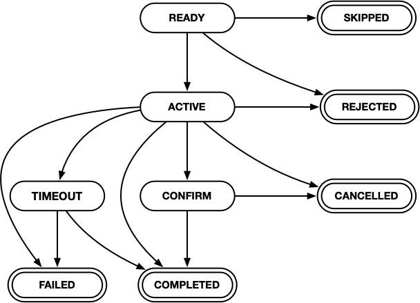
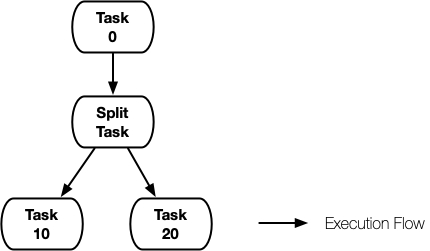
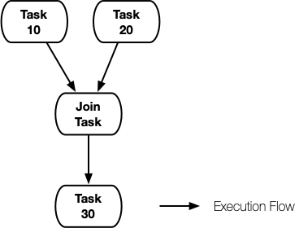
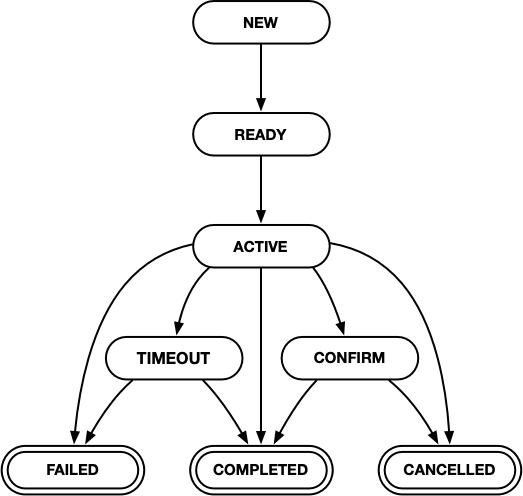

# Leitstand Job Model

The Leitstand Job Model is a generalized model to describe arbitrary jobs as set of connected tasks forming a finite state machine. 
The model also provides the means to schedule a job execution to a future date and to manage running jobs.

## Leitstand Job Model

### Overview

 

A job is a set of tasks, that are executed in a specified order.
Each task belongs exactly to one job. 
Each task has zero, one or more transitions to subsequent tasks.
A task without outgoing transition is an _terminal_ task.
A job is done if all terminal tasks are executed.
A job can be described as a finite state machine,
where each state represents a task executed by the job.

### Task

A task represents a single REST API invocation.
All information needed to invoke the REST API operation is conveyed in the task.

#### Task Settings
Each task has a unique ID in UUIDv4 format, 
a descriptive task name,
a task type, and
task parameters.

The task type allows to categorize tasks.
All task of the same type are processed in the same way, 
which means that a Leitstand application can configure _task processors_ per task type.

The task parameters convey all information needed to invoke the REST API endpoint.

#### Task State
A task is in one of the following _task states_ illustrated below.

 

| State         | Description                                                                              |
|:--------------|:-----------------------------------------------------------------------------------------|
| __READY__     | The task is eligible for execution provided that all preceding tasks have been completed.|
| __ACTIVE__    | The task is in progress.                                                                 |
| __SKIPPED__   | The task has been skipped and will not be processed.                                     |
| __CONFIRM__   | The task awaits to confirm the successful execution.                                     |
| __COMPLETED__ | The task was completed successfully.                                                     |
| __REJECTED__  | The task was rejected without having been executed.                                      |
| __FAILED__    | The task execution failed.                                                               |
| __TIMEOUT__   | The task execution exceeded a configured timeout.                                        |

The task states __SKIPPED__, __COMPLETED__, __REJECTED__, __SKIPPED__, and __FAILED__ are _terminal_ states.
Tasks in a terminal state have been processed.

#### Split Task
A split task has two or more subsequent tasks. 
The execution flow is _splitted_ into parallel execution flows, one per task each.

 

#### Join Task
A join task has two or more preceding tasks.
A join tasks gets executed when all preceding tasks have been executed successfully.
The join tasks unites parallel execution flows into a single execution flow.

 

### Job

Jobs are modeled as _finite state machines_.
Each task represents a state in the state machine.
The state transitions define the successors of a task.

 

#### Job Settings

##### General Settings
Each job has a unique job ID in UUIDv4 format,
a descriptive job name, and
an optional description.

##### Job Schedule
The schedule date defines when the job shall be executed.
The optional suspension date defines when a job must be suspended in case not all tasks have been completed by then.
The auto-resume flag starts the execution of the remaining tasks at the same time on the next day.

##### Canary Mode Support
In [canary mode](https://en.wikipedia.org/wiki/Sentinel_species#Historical_examples) a job awaits to confirm the successful execution of every first task of each task type.
This allows to schedule a single job for a set of devices but still to validate a task outcome on a single device before the task is executed on all remaining devices.

##### Job Application and Job Type
The job application identifies which Leitstand application created the job.
The job type allows an application to differentiate between different jobs.

#### Job State
A job is one of the following states:

 

| State         | Description                                                                |
|:--------------|:---------------------------------------------------------------------------|
| __NEW__       | A job draft that is not eligible for execution.                            |
| __READY__     | The job is ready for being executed.                                       |
| __ACTIVE__    | The job is in progress.                                                    |
| __CONFIRM__   | The job awaits to confirm the successful execution of one or more tasks.   |
| __COMPLETED__ | The job was completed successfully, i.e. all tasks are completed.          |
| __FAILED__    | The job execution failed, i.e. at least one task failed.                   |
| __TIMEOUT__   | The job is timed out, i.e. at least one task exceeded a configured timeout.|

#### Job Execution
Jobs are executed in a distributed, event-driven fashion.
The job scheduler does not actively wait for a task to complete, but gets notified when a task is completed 
as illustrated in the task execution flow sequence diagram illustrated earlier.
The Leitstand job scheduler executes the first task of the job, which is called the _start task_.
Once the start task has been completed, the successors of the start task are eligible of execution.
The job scheduler proceeds executing all tasks in this way, until either no more tasks are left or the execution of a task failed.

## Job Scheduler

### Job Event Loop
The Job Event Loop searches for new jobs eligible for execution and executes the job start task.
The remaining job tasks are processed in an event-driven fashion.

### Task Execution Flow
Tasks are expected to be executed _asynchronously_. 
Asynchronous execution guarantees that job scheduler threads do not actively wait for tasks being completed and prevents the thread pool from being exhausted.

The _connector_ micro-service translates a task to the API invocation and establishes the asynchronous execution flow.

 

The connector _accepts_ the REST API invocation by sending an `Accepted` response, which frees the job scheduler thread right after the task has been marked as active.
Next, the connector invokes the actual REST API endpoint and sends the operation outcome to the task post-back endpoint, which was specified when the connector was called.

The task state update triggers the search for subsequent tasks eligible for execution.
A task can be executed if all preceding tasks have been completed successfully.

## Scopes

The following scopes exist for managing job access privileges:

| Scope      | Description                                                                                      |
|:-----------|:-------------------------------------------------------------------------------------------------|
| _job_      | Full job scheduler access including deletion of completed jobs and cancellation of running jobs. |
| _job.read_ | Readonly job scheduler access.                                                                   |
| _job.task_ | Manage job tasks including updating the processing state of a single task.                       |

